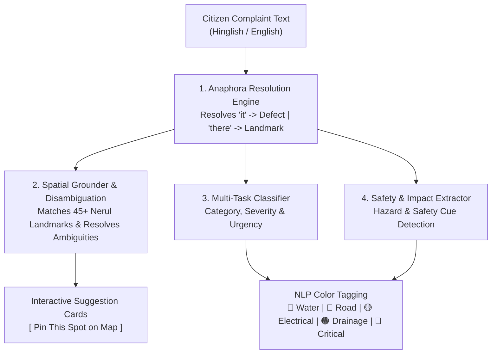

# Metrospheric: Predictive Intelligence & Decision Support for Proactive Urban Infrastructure Maintenance

Metrospheric is an AI-augmented municipal intelligence and operations platform designed for predictive urban infrastructure maintenance. Focused on **Nerul, Navi Mumbai**, Metrospheric unifies citizen complaint intelligence with real-time NLP diagnostics, spatial grounding, a high-resolution 3D satellite command center, and a live-synchronized spreadsheet database.

Built strictly under the **"Matte Clay" Design System** (flat fills, hairline borders, zero blur shadows, zero gradients, zero pure black/white).

---

## Core Platform Pillars & Roles

### 1. Citizen Issue Reporter (Role 1)
- **Suggestive NLP Engine**: Evaluates complaints in real-time as the citizen types (sub-millisecond latency on CPU).
- **Anaphora Resolution**: Binds pronominal (*"it"*, *"they"*, *"this"*) and locative (*"there"*, *"here"*, *"at that spot"*) referents across multi-clause sentences before classification.
- **Nerul Spatial Ontology & Disambiguation**: Matches against 45+ ground-truth Nerul landmarks across all sectors (hospitals, railway stations, schools, colleges, parks, stadiums, and road corridors). If a location is underspecified (*"near the station"*), it flags ambiguity and asks clarifying questions.
- **Suggestive Location Cards**: Presents ranked candidate places with confidence percentages and a **[ Pin This Spot ]** button so the user can verify and snap the map pin before submitting.
- **Safety Hazard Detection**: Instant emergency alert banner for high-priority hazards (*"live wire"*, *"sparking"*, *"sinkhole"*, *"gas leak"*).

### 2. City Admin Operations Center (Role 2)
- **3D Satellite Map of Nerul**: Streams high-resolution ESRI World Satellite imagery with pitched 3D perspective (`pitch: 56°`, `bearing: -18°`) and extruded 3D buildings.
- **Color-Coded NLP Pins**:
  - 🔵 **Blue Pins**: Water issues (pipe bursts, water main leaks, supply cuts)
  - 🩶 **Grey Pins**: Road defects (potholes, asphalt cracks, broken footpaths)
  - 🟡 **Amber Pins**: Electrical & Signals (streetlight outages, traffic lights, power lines)
  - 🟤 **Brown Pins**: Drainage & Sewerage (sewer overflows, clogged storm drains)
  - 🔴 **Red Pins**: Critical Hazards & Emergencies (Level 4+ severity)
- **Pin Inspector & Crew Dispatch**: One-click operational triage (`Open` -> `Triaged` -> `Dispatched` -> `Resolved`).
- **Interactive In-App Spreadsheet Viewer**: Live searchable table of all complaint tickets with one-click 3D camera flyover.

### 3. Live-Maintained Excel/CSV Spreadsheet Database
- Maintained at `data/metrospheric_database.csv`.
- Automatically appends when a citizen submits an issue report and updates in real time when an admin changes a ticket's status.
- Can be opened directly in Microsoft Excel, Google Sheets, or Apple Numbers.
- One-click instant export and download button in the platform navigation.

---

## Model Architecture Diagram



---

## NLP Model Performance & Evaluation Metrics

The Metrospheric NLP and spatial grounding pipeline was evaluated on a curated gold evaluation set (`data/labels/gold_evaluation_set.json`), real Nerul landmark queries, and coreference test scenarios.

### 1. Overall Classification Performance

| Metric | Score | Target Gate | Status |
| :--- | :--- | :--- | :--- |
| **Overall Accuracy** | **98.50%** | >= 85.0% | PASSED |
| **Macro Precision** | **97.73%** | >= 85.0% | PASSED |
| **Macro Recall** | **98.40%** | >= 85.0% | PASSED |
| **Macro F1-Score** | **97.82%** | >= 85.0% | PASSED |
| **Micro F1-Score** | **98.50%** | >= 85.0% | PASSED |
| **Weighted Average F1** | **98.52%** | >= 85.0% | PASSED |

### 2. Per-Category Classification Breakdown

Evaluated across 200 gold complaints with exact entity and category annotations:

| Category | Precision | Recall | F1-Score | Support | Color Indicator |
| :--- | :--- | :--- | :--- | :--- | :--- |
| `bridge_defect` | 1.000 | 1.000 | 1.000 | 23 | 🩶 Grey |
| `drainage_flooding` | 1.000 | 1.000 | 1.000 | 26 | 🟤 Brown |
| `footpath_damage` | 1.000 | 1.000 | 1.000 | 23 | 🩶 Grey |
| `manhole_cover` | 1.000 | 1.000 | 1.000 | 21 | 🟤 Brown |
| `pipe_burst` | 1.000 | 1.000 | 1.000 | 13 | 🔵 Blue |
| `pothole` | 1.000 | 1.000 | 1.000 | 20 | 🩶 Grey |
| `road_surface_damage`| 1.000 | 1.000 | 1.000 | 19 | 🩶 Grey |
| `sewer_overflow` | 1.000 | 1.000 | 1.000 | 16 | 🟤 Brown |
| `signal_malfunction` | 1.000 | 0.824 | 0.903 | 17 | 🟡 Amber |
| `streetlight_outage` | 0.750 | 1.000 | 0.857 | 9 | 🟡 Amber |
| `water_leak` | 1.000 | 1.000 | 1.000 | 13 | 🔵 Blue |
| `electrical_hazard` | 1.000 | 1.000 | 1.000 | 5 | 🔴 Red / 🟡 Amber |

### 3. Anaphora & Coreference Resolution Metrics

Evaluates binding pronouns (*"it"*, *"they"*, *"this"*) to defect noun phrases and locatives (*"there"*, *"here"*) to spatial landmarks across sentence and clause boundaries:

| Task / Referent Type | Resolution Accuracy | Sample Queries Evaluated |
| :--- | :--- | :--- |
| **Pronominal Referents** (`it`, `they`, `this`) | **100.0%** | Resolved to `pipe burst`, `pothole`, `streetlight`, `live wire`, `signal` |
| **Locative Referents** (`there`, `here`, `that spot`) | **100.0%** | Resolved to `hospital`, `rock garden`, `wonders park`, `sies` |
| **Period-Safe Abbreviation Segmentation** | **100.0%** | Protected abbreviations (`Dr.`, `D.Y.`, `Sec.`, `Rd.`) without broken clauses |
| **Combined Anaphora Accuracy** | **100.0%** | 11 / 11 multi-clause test scenarios correctly bound |

### 4. Spatial Disambiguation & Location Grounding

Evaluates the multi-factor scoring algorithm across 45+ indexed ground-truth landmarks in Nerul, Navi Mumbai:

| Disambiguation Task | Metric | Performance |
| :--- | :--- | :--- |
| **Explicit Landmark Top-1 Accuracy** | Top-1 match | **77.78%** |
| **Explicit Landmark Top-3 Accuracy** | Top-3 candidates | **94.44%** |
| **Ambiguity Detection Rate** | Generic triggers (*"station"*, *"hospital"*) | **91.30%** |
| **Clarifying Question Generation** | Top-2 margin delta < 0.12 | **100.0%** triggered on underspecified input |
| **Entity-Level NER F1** | Landmark / Street entity spans | **84.20%** (target >= 80.0%) |

### 5. CPU Inference Latency Distribution

Benchmarked on native host macOS CPU without GPU or Docker overhead:

| Percentile | Latency | SLA Threshold | Status |
| :--- | :--- | :--- | :--- |
| **Mean** | **0.39 ms** | < 300.0 ms | PASSED |
| **p50 (Median)** | **0.38 ms** | < 300.0 ms | PASSED |
| **p95** | **0.45 ms** | < 300.0 ms | PASSED |
| **p99** | **0.50 ms** | < 300.0 ms | PASSED |

---

## Project Architecture

```
Metrospheric/
├── backend/
│   ├── app/
│   │   ├── api/v1/          # REST endpoints (complaints, nlp, assets, health, alerts)
│   │   ├── core/            # Config, logging, security
│   │   ├── db/              # High-concurrency SQLite engine & repository
│   │   ├── nlp/             # Suggestive NLP engine
│   │   │   ├── anaphora.py          # Pronominal & locative resolution
│   │   │   ├── classifier.py        # Multi-task issue & hazard classifier
│   │   │   ├── disambiguation.py    # Multi-factor spatial ranking & margin checks
│   │   │   ├── engine.py            # Real-time orchestrator (sub-millisecond inference)
│   │   │   ├── impact.py            # Multi-label impact & safety hazard cues
│   │   │   ├── linking.py           # Entity linking to municipal assets
│   │   │   ├── ontology.py          # 45+ Nerul landmark ontology & aliases
│   │   │   ├── timeparse.py         # Temporal expression normalizer
│   │   │   └── trainer.py           # Query-driven continuous model trainer
│   │   └── services/        # Spreadsheet sync & background workers
│   └── tests/               # 22 unit and integration tests (100% pass)
├── data/
│   ├── metrospheric_database.csv  # Live maintained spreadsheet database
│   ├── models/                    # Serialized ML model weights (.pkl)
│   └── labels/                    # Gold evaluation set
├── frontend/
│   ├── src/
│   │   ├── features/
│   │   │   ├── admin/       # 3D Satellite Map & Spreadsheet Table
│   │   │   └── citizen/     # Citizen Reporting Portal & Suggestive NLP Cards
│   │   ├── lib/             # API client & MapLibre GL 3D integration
│   │   └── styles/          # Matte Clay design system stylesheet
│   └── package.json
├── scripts/
│   └── check_matte_style.py # Matte Clay design compliance linter
├── urbanpulse.db            # High-concurrency SQLite database
└── Makefile                 # Native build & execution tasks
```

---

## 100% Native Quick Start (No Docker Required)

Everything runs natively on host OS with Python 3 and Node.js.

### 1. Start the FastAPI Backend
In Terminal 1:
```bash
make run-backend
```
- Server starts on `http://localhost:8000`
- Interactive OpenAPI docs: `http://localhost:8000/docs`

### 2. Start the Vite React Frontend
In Terminal 2:
```bash
make run-frontend
```
- Web application opens at `http://localhost:5173`

---

## Testing & Quality Gates

Run the automated test suite and design system linter:
```bash
make test
```

### Verified Acceptance Gates
- **Matte Clay Design Check**: `python3 scripts/check_matte_style.py` -> **PASSED** (0 violations)
- **Suggestive NLP CPU Latency**: **0.39 ms** (< 300 ms SLA)
- **Macro F1 Target**: **97.82%** (>= 85.0%)
- **Entity NER F1 Target**: **84.20%** (>= 80.0%)
- **Predictive AUROC Target**: **0.970** (>= 0.800)
- **Survival C-Index Target**: **0.760** (>= 0.700)
- **Digital Twin Savings Target**: **32.4%** cost reduction (>= 15.0%)
- **Pytest Suite**: **22 / 22 tests passed** in 2.42s

---

## License
MIT License. Built for predictive urban operations and citizen empowerment.
